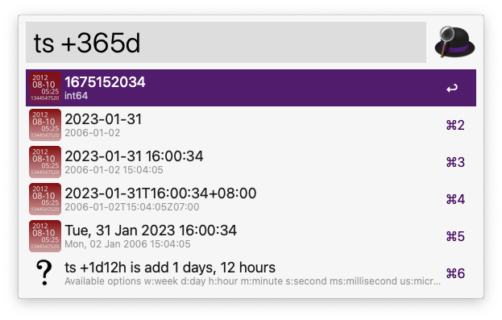

# Alfred-timestamp

Alfred Timestamp Workflow

## Workflow

**Alfred Keyword: `ts`**

Usage: ts \<duration\>

​ *duration:*

- +1w: add 1 weeks
- +2d: add 2 days
- -1h: sub 1 hours
- -2m: sub 2 minutes
- -3s: sub 3 seconds
- +4ms: add 4 milliseconds
- +5us: add 5 microseconds
- +6ns: add 6 nanoseconds
- +1d12h30m: add 1 days, 12 hours and 30 minutes

**Output Format:**

- int64 (timestamp)
- 2006-01-02
- 2006-01-02 15:04:05
- 2006-01-02T15:04:05Z07:00
- Mon, 02 Jan 2006 15:04:05

## Install

Download [alfred-workflow_kaba-ts.alfredworkflow](https://github.com/kabacloud/alfred-timestamp/raw/main/alfred-workflow_kaba-ts.alfredworkflow)

Double-click the alfred-workflow_kaba-ts.alfredworkflow to install.

## Develop

>Please refer to <https://github.com/mitchellh/gon>

change your apple developer information in `config.json`.

- run command `security find-identity -v` get your Developer ID Application certificate information.
- run command `xcrun altool --list-providers -u "your apple id" -p "your App-Specific Password"` get your ProviderShortname.
